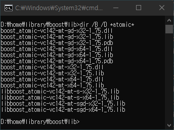
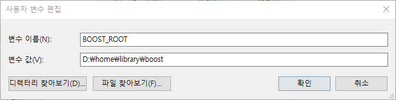

# Build Boost Library

> This contents is myself to reference log later.  
> Platform: Windows 10  
> Keyword: boost library, cmake, vscode, cpp  

## Download

- download latest boost library source.

  ```url
  https://www.boost.org/users/download/
  ```

## Bootstrap

- make b2 using bootstrap script.

  ```cmd
  bootstrap
  ```

## Build Library

- build library with b2.
- result files will be located at `d:\home\library\boost`.

### Build Static library

- will be static boost library.
- with static runtime-link.

  ```cmd
  b2 variant=debug,release link=static threading=multi address-model=32,64 runtime-link=static -j 16 --prefix=d:\home\library\boost install
  ```

### Build Shared library

- will be shared boost library.
- with shared runtime-link.

  ```cmd
  b2 variant=debug,release link=shared threading=multi address-model=32,64 runtime-link=shared -j 16 --prefix=d:\home\library\boost install
  ```

## Result

- static libraries
  - 32bit static debug lib.
  - 32bit static release lib.
  - 64bit static debug lib.
  - 64bit static release lib.
- shared libraries
  - 32bit shared debug lib.
  - 32bit shared debug dll.
  - 32bit shared release lib.
  - 32bit shared release dll.
  - 64bit shared debug lib.
  - 64bit shared debug dll.
  - 64bit shared release lib.
  - 64bit shared release dll.
- sample screenshot
  - atomic libraries.  
    
- about filename
  - `mt`: multi thread.
  - `gd`: debug.
  - `s`: static.

## Using Boost Library with CMake

### System Environment Variable

- set `BOOST_ROOT` environment variable.

  ```env
  BOOST_ROOT d:\home\libaray\boost
  ```

  

### Sample

- project directory tree.

  ```cmd
  project_root |-CMakeLists.txt
               |-src
               |    |-CMakeLists.txt
               |    |-main.cpp
               |
               |-build
                    |-bin
                        |-Debug
                        |   |-sample.exe
                        |
                        |-Release
                            |-sample.exe
  ```

- `Project`/CMakeLists.txt

  ```cmake
  ## CMAKE_MSVC_RUNTIME_LIBRARY is available from 3.15 version.
  cmake_minimum_required(VERSION 3.15)
  ## for find_package
  cmake_policy(SET CMP0074 NEW)
  ## for CMAKE_MSVC_RUNTIME_LIBRARY
  cmake_policy(SET CMP0091 NEW)
  ## project
  project(boost-sample)

  ## option for using static library
  ## if this value is changed, delete cache and re-configure.
  option(WITH_STATIC_LIBRARY "Build with static library" ON)

  ## configuration of output file location
  set(CMAKE_ARCHIVE_OUTPUT_DIRECTORY "${CMAKE_BINARY_DIR}/lib")
  set(CMAKE_LIBRARY_OUTPUT_DIRECTORY "${CMAKE_BINARY_DIR}/lib")
  set(CMAKE_RUNTIME_OUTPUT_DIRECTORY "${CMAKE_BINARY_DIR}/bin")

  ## configuration of library linking
  if(WITH_STATIC_LIBRARY)
    ## static library linking
    set(CMAKE_MSVC_RUNTIME_LIBRARY "MultiThreaded$<$<CONFIG:Debug>:Debug>")
    set(Boost_USE_STATIC_LIBS ON)
    set(Boost_USE_STATIC_RUNTIME ON)
  else()
    ## dynamic library linking
    set(CMAKE_MSVC_RUNTIME_LIBRARY "MultiThreaded$<$<CONFIG:Debug>:Debug>DLL")
    set(Boost_USE_STATIC_LIBS OFF)
    set(Boost_USE_STATIC_RUNTIME OFF)
  endif()

  ## search boost library
  ## system environment `BOOST_ROOT` must be set.
  find_package(Boost REQUIRED COMPONENTS regex)

  ## result of finding boost library 
  if(NOT Boost_FOUND)
    message(FATAL_ERROR "Boost NOT FOUND")
  else()
    message("BOOST Version: ${Boost_VERSION}")
    message("BOOST_ROOT: ${BOOST_ROOT}")
    message("BOOST_INCLUDEDIR: ${Boost_INCLUDE_DIRS}")
    message("BOOST_LIBRARYDIR: ${Boost_LIBRARY_DIRS}")
  endif()

  ## additional library directories for boost.
  link_directories("${Boost_LIBRARY_DIRS}")

  ## additional include directories for boost.
  include_directories("${Boost_INCLUDE_DIRS}")

  ## additional include directories for project.
  include_directories("${CMAKE_SOURCE_DIR}/src")

  ## main source directory
  add_subdirectory(src)
  ```

- `Project`/src/CMakeLists.txt

  ```cmake
  cmake_minimum_required(VERSION 3.15)

  ## source files.
  set(FILE_SOURCES
   "main.cpp"
  )
  ## header files.
  set(FILE_HEADERS
  )

  ## this project is for executable file.
  add_executable(${CMAKE_PROJECT_NAME}
    ${FILE_SOURCES}
    ${FILE_HEADERS}
  )
  ## additional link libraries for boost.
  target_link_libraries(${CMAKE_PROJECT_NAME} ${Boost_LIBRARIES})
  ```

- `Project`/src/main.cpp

  ```cpp
  //! regex need library linking, is not header file only.
  #include <boost/regex.hpp> 
  #include <iostream>
  #include <string>

  int main()
  {
    std::string line;
    boost::regex pat("^hello (.*)");

    while (std::getline(std::cin, line))
    {
      if (line == "exit") break;

      boost::smatch matches;
      if (boost::regex_match(line, matches, pat))
      {
        std::cout << matches[1] << std::endl;
      }
    }

    return 0;
  }
  ```

- vscode include path
  - Edit `settings.json` of `User` or `Workspace`, (Key: Ctrl+,).

    ```json
    "C_Cpp.default.includePath": ["${BOOST_ROOT}/include/boost-1_75"]
    ```

  - if shared linking
    - manually copy dll file to output directory.
    - or, add `${BOOST_ROOT}/lib` to `PATH` environment variable.

## Reference

- [B2 User Manual#4.4.Invocation](https://boostorg.github.io/build/manual/develop/index.html#bbv2.overview.invocation)
- [FindBoost - CMake](https://cmake.org/cmake/help/latest/module/FindBoost.html)
- [CMAKE_MSVC_RUNTIME_LIBRARY - CMake](https://cmake.org/cmake/help/latest/variable/CMAKE_MSVC_RUNTIME_LIBRARY.html)
